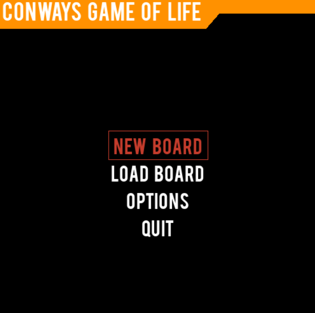
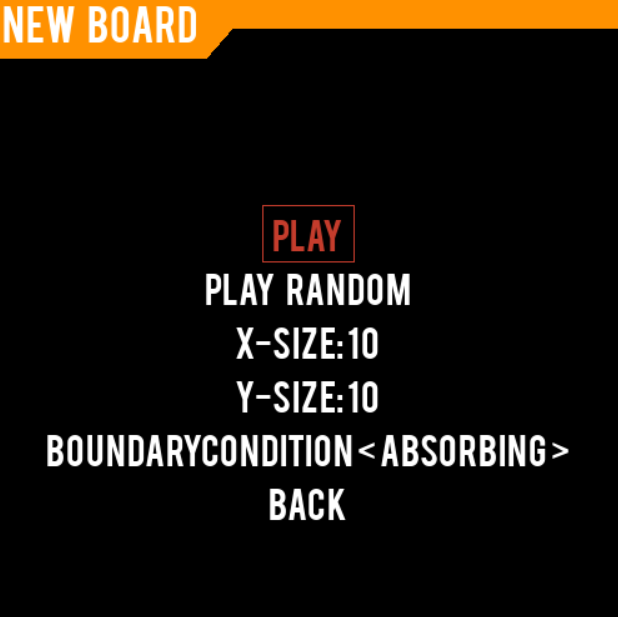
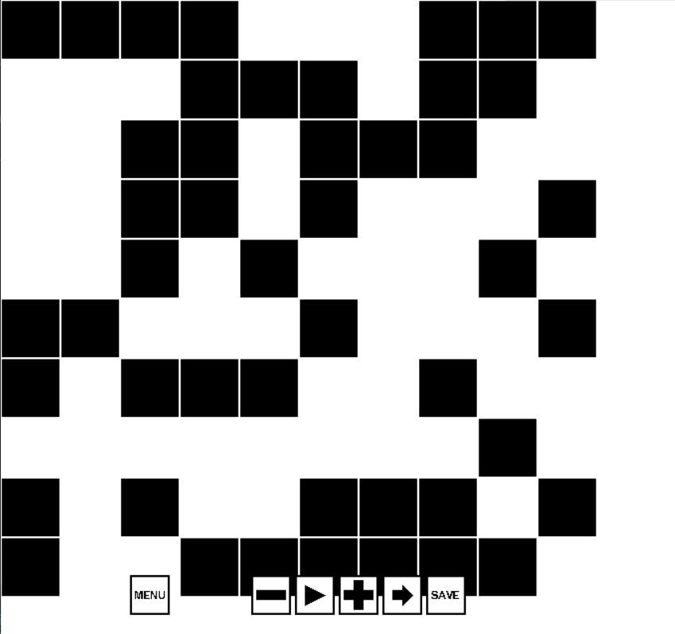

# gameOfLife
This is a *graphical* python implementation of Conways Game of Life using pygame. </br>

||||
|:---:|:---:|:---:|
||||
||||


## Features
* Saving and loading setups to and from file
* graphical game controls:
    * pause/resume
    * set speed
    * generating a single new generation 
* random board generation at runtime
* different boundary conditions (absorbing, periodic, reflecting)
* background music

## Executables
There is an executable provided for windows users [here]().
Mac/Linux users have to run from source or can adapt the build script and generate an executable.

## Running from source
* python 3.9 (used for development)
* pygame
* pygame-menu==2.1.2
* numpy

Or install from the requirements file and pygame manually.

**Note:**
Currently pygame has no package for python 3.9. Please use the preview package (--pre).

## Building an executable
A build script is provided with buildWindows.bat for windows.
For this a python virtual environment in a folder called "venv" (gameOfLife/venv/) with the pyinstaller python package is required.</br>
If the requirements are met:</br>
1. activate the venv: </br>
    ```.\venv\Scripts\activate.bat```
2. build the application
    ```.\buildWindows.bat```

You now have a folder with an executable in you builds\windows folder.

## Credits
Backgroundmusic: Aviators (https://www.youtube.com/watch?v=sisGSwT2eN0)
